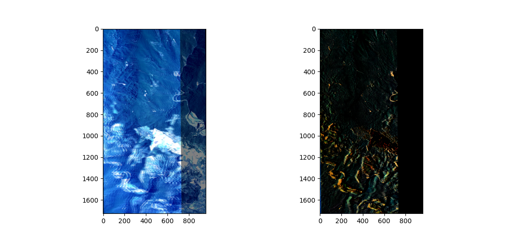

# Introduction
This repo aims to generate the 3D point cloud from two 2D images. All processes includes **Tie Point Finding**, **Rectification**, **Dense Matching** and **Point Cloud Generating**.

# Result
## CASE1: Aerial Image
1. Source
    | Left | Right |
    | --- | --- | 
    | |  |

2. Result
    - 

## CASE2: Road Quality (Smoothness) Measurement: with hand-crafted processes
1. Source 
    - Video: 
        - 


    - Images
        | Left | Right |
        | --- | --- | 
        | |  |

2. Result
    - 

# Theory
Please see [Pinhole Camera Model PPT](https://docs.google.com/presentation/d/1d6rK1UMtkgI-SxBe5717WRXsQCkIL9Wc/edit?usp=sharing&ouid=110278970958064225979&rtpof=true&sd=true)

# Scripts
- TiePoints.py: Use SIFT, ORB and SURF to find the sparse matching point (same point in real world) from 2 images.
    ```
    python TiePoints.py
    ```
    - 
    - 
    - 
    - 
    - 
    - 
    - 
    - 
    - 
    - 
    - 
    
- Rectification.py: Rectify the image for application of SGBM reduce the searching dimension from two dimensions to one dimension.)
    ```
    python Rectification.py
    ```
    - 
    - 
    - 

- SGBM_opencv.py: OpenCV version SGBM.
    ```
    python SGBM_opencv.py
    ```
    - 
    - 
    - 
    - 
    - 

- AeroTriangulation.py: Conversion between 2D image pixels into 3D object points.
    ```
    python AeroTriangulation.py
    ```

- AeroTriangulation_tf.py: This is used for calibrate the relational extrinsic parameters of stereo camera. But its recommended to use the chessboard to calibrate the extrinsic parameters of stereo camera.
    ```
    python AeroTriangulation_tf.py
    ```
    - 

- io_aereo_params.py: This is used for get the saved aereo parameters (OPK, L_XYZ, DMC_ROWS_LABEL, DMC_COLS_LABEL, DMC_FOCAL_LENGTH, DMC_PIXEL_SIZE, XOFFSET, YOFFSET)

- temp_refine_resolution.py: This is used to lower the resolution of original images in order to push the images on to the gitlab.

- SGBM.py: This is jit implementation of SGBM which can be used to learn SGBM, but its efficiency is not terrible. **currently not working**.
